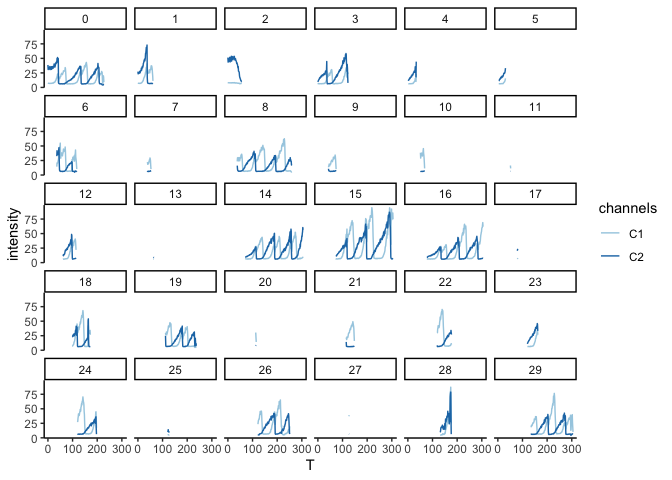
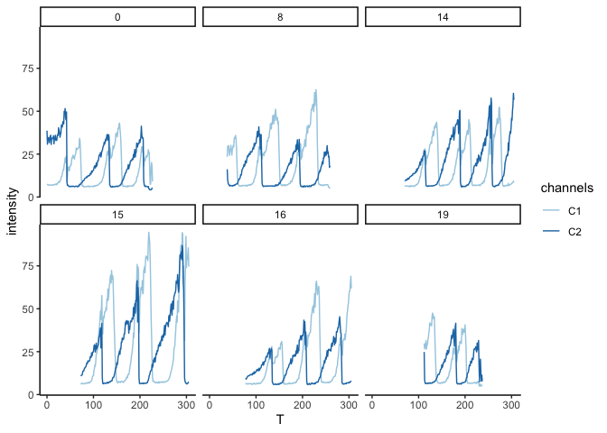

R Notebook
================

This is an [R Markdown](http://rmarkdown.rstudio.com) Notebook. When you
execute code within the notebook, the results appear beneath the code.

Try executing this chunk by clicking the *Run* button within the chunk
or by placing your cursor inside it and pressing *Cmd+Shift+Enter*.

``` r
library(tidyverse)
```

    ## ── Attaching core tidyverse packages ──────────────────────── tidyverse 2.0.0 ──
    ## ✔ dplyr     1.1.4     ✔ readr     2.1.4
    ## ✔ forcats   1.0.0     ✔ stringr   1.5.1
    ## ✔ ggplot2   3.4.4     ✔ tibble    3.2.1
    ## ✔ lubridate 1.9.3     ✔ tidyr     1.3.0
    ## ✔ purrr     1.0.2     
    ## ── Conflicts ────────────────────────────────────────── tidyverse_conflicts() ──
    ## ✖ dplyr::filter() masks stats::filter()
    ## ✖ dplyr::lag()    masks stats::lag()
    ## ℹ Use the conflicted package (<http://conflicted.r-lib.org/>) to force all conflicts to become errors

``` r
library(RColorBrewer)

df <- read_csv('XY01-1_Intensities.csv')
```

    ## Rows: 5464 Columns: 10
    ## ── Column specification ────────────────────────────────────────────────────────
    ## Delimiter: ","
    ## dbl (10): Spot, TrackID, X, Y, Q, Z, T, C1, C2, C3
    ## 
    ## ℹ Use `spec()` to retrieve the full column specification for this data.
    ## ℹ Specify the column types or set `show_col_types = FALSE` to quiet this message.

``` r
dfl <- pivot_longer(df, c(C1, C2, C3), names_to = "channels", values_to = "intensity")
plot1 <- dfl |> 
  filter(TrackID >= 0) |>
  filter(TrackID < 30) |>
  filter(channels != "C3") |> 
  ggplot(aes(x=T, y=intensity, color=channels)) +
  geom_line() +
  scale_colour_brewer(palette = "Paired") +
  theme_classic() +
  facet_wrap(~factor(TrackID))

plot1
```

<!-- -->

``` r
goodones <- c(0, 8, 14, 15, 16, 19)
plot2 <- dfl |> 
  filter(TrackID %in% goodones) |>
  # filter(TrackID < 30) |>
  filter(channels != "C3") |> 
  ggplot(aes(x=T, y=intensity, color=channels)) +
  geom_line() +
  scale_colour_brewer(palette = "Paired") +
  theme_classic() +
  facet_wrap(~factor(TrackID))

plot2
```

<!-- -->
