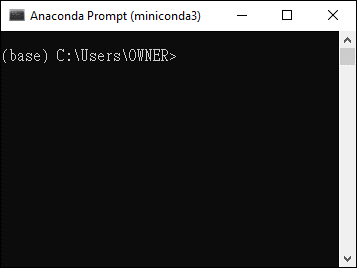
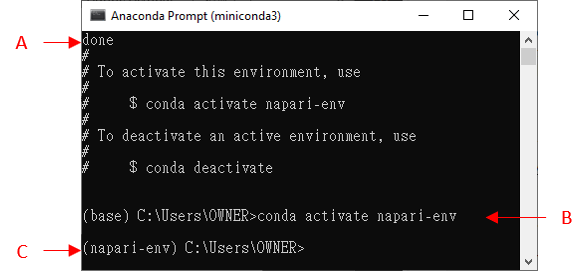

# Napariの基礎知識と書き方ーPythonの環境セットアップ

20250129 黄 承宇

## Anaconda/Minicondaのインストール

Pythonパッケージ管理ツールであるconda (https://conda.io/projects/conda/en/latest/index.html) を使用してPython環境を設定する。condaにはAnacondaとMinicondaの2つのバージョンがあり、どちらも本章および後の章で必要なPython環境の作成と管理が可能である。ただし、Minicondaはコマンドラインでのみ操作可能であるのに対し、Anacondaはコマンドラインに加え、GUI（グラフィカルユーザーインターフェース）で環境管理が可能である。そのため、Anacondaはプログラミング初心者にとってより使いやすい一方、Minicondaよりも多くのストレージを必要とする(約4.4 GB対約480 MB)[^1]。

本チュートリアルでは、すべてをコマンドラインで行うため、Minicondaで十分である。ダウンロードリンクは次になる。

Latest Miniconda installer links
https://docs.anaconda.com/miniconda/#miniconda-latest-installer-links

以下の説明はWindowsのOS環境での説明になるが、Apple社のMacでもほぼ同じように作動する。以下、Macと操作が違う部分では脚注を入れている。

[^1]: Minicondaとanacondaの違いの詳細については次のリンク先を参照されたい。
[Should I use Anaconda Distribution or Miniconda?](https://docs.anaconda.com/distro-or-miniconda/)


## Minicondaで仮想環境(venv)を作成する

次に、condaを使って仮想環境(virtual environment, venv)を作成する。仮想環境は、異なるプロジェクトごとに必要なパッケージを分けて管理するためのツールである。これにより、各プロジェクトに独立したワークベンチを作成し、その中でパッケージの依存関係を管理できる。多くの場合、プロジェクトによって異なるパッケージやそのバージョンが必要であるため、複数のプロジェクトを共存させるとパッケージコンフリクトによりプロジェクトが動かなくなることがある。こうした問題を防ぎ、パッケージをプロジェクト単位で管理するために仮想環境を使用する。さらに、作った仮想環境が破損した場合でも、環境を削除して再作成することが可能である。

まず、コマンドラインからこの章で使う仮想環境を作成する[^2]。

上記のサイトでMinicondaをインストールしたら、エクスプローラーで “**anaconda prompt (miniconda3)**” を見つけてクリックする (Macでは、**ターミナル** (**Terminal**)と呼ぶ。ここでの使い方はWindowsでのanaconda promptと変わらない)。**図1**のような画面が現れる。



*図1: Anaconda Promptのスタート画面*

**図1**のプロンプト中の`(base)`は、現在デフォルトの環境（ベース）にいることを意味している。次に、napari-envという名前の仮想環境を作成する。名前の付け方は任意だが、このようになるべくわかりやすい名前がよい。この名前で新しい仮想環境を作成するには、次のコマンドを実行する：

```bash
conda create -y -n napari-env -c conda-forge python=3.11
```

ここでは、Python 3.11の仮想環境を作成する。今回は`napari-env`と名付けている[^3]。condaが続行するかどうか尋ねる場合`proceed([y]/n)?` には、`y`を入力する。インストールが完了すると、`done`と表示される（**図2A**）。次に、仮想環境を `conda activate` コマンドでアクセスする（**図2B**）。コマンドラインの始まりが `(base)`から`(napari-env)`に変わる（**図2C**）。これは、`napari-env`の仮想環境に入ったことを意味する。



*図2: napari-env 仮想環境に入る*

[^2]: 環境の作成法に関する詳細なチュートリアルは次のリンクにある: [Managing environments — conda 24.9.2.dev8 documentation](https://docs.conda.io/projects/conda/en/latest/user-guide/tasks/manage-environments.html)

[^3]: このコマンドでは、`-n`は`--name`の省略形で、新しい環境に付ける名前を指定するオプションだ。`-y`は`--yes`の省略形で、確認プロンプトをスキップし、自動的に続行するためのオプションである。`-c`は`--channel`の省略形で、パッケージをインストールする際に使うチャンネルを指定するもので、ここでは信頼性の高い`conda-forge`チャンネルを使用している。詳しくは、以下のリンクを参考: [conda create — conda 24.9.3.dev19 documentation](https://docs.conda.io/projects/conda/en/latest/commands/create.html#positional-arguments)


## napariとJupyterノートブックおよびその他のパッケージのインストール

`(napari-env)`に入ったら、まずnapariをインストールする[^4]：

```bash
python -m pip install "napari[all]"
```

インストールが終わると、**図2C**の`(napari-env) ...>` が再び表示される。

次に、他の画像解析や画像処理に頻繁に使われるパッケージをインストールする。これには、コーディングやnapariとのインターフェースに使用するjupyter、画像処理やマトリックス計算を含む数値演算のためのnumpy、作図のためのmatplotlib、科学計算のためのscipy、画像処理に使われる多くのアルゴリズムを含むscikit-image、及び表形式データの操作のためのpandasが含まれている。これらのパッケージをインストールするには、次のコマンドを実行する[^5]：

```bash
pip3 install numpy matplotlib scipy scikit-image jupyter pandas
```

`proceed([y]/n)?` と表示されたら、`y`を入力し、<kbd>Enter</kbd>キーを押す。

以上で環境インストール手順は終了である。

[^4]: パッケージのインストール方法はpipを使う以外にも例えばcondaでインストールしたりと複数の方法がある。他にインストールしているパッケージのバージョンや環境の違いによって、動作する場合やしない場合があるので、上手くいかない場合は仮想環境上で色々なインストールの仕方を試してみると良いだろう。

[^5]: これらのパッケージの一部は、すでに`napari[all]`と一緒にインストールされている。ここでは説明と明確化のために、すべてのライブラリをコマンドラインに含めている。`Requirement already satisfied`と表示される場合は、そのライブラリがすでにインストールされていることを意味している。

## 次回napari-env環境に戻る方法

コマンドウィンドウを閉じてから、前回作成した仮想環境に再度戻りたい場合がある。しかし、コマンドプロンプトを再起動するたびに、常に`(base)`環境に戻ってしまう。 `(napari-env)`仮想環境に戻るには、次のコマンドを入力し、<kbd>Enter</kbd>キーを押す：

```bash
conda activate napari-env
```

仮想環境名を異なる名前にした場合や、作成した仮想環境の一覧を確認したい場合は、次のコマンドを入力して<kbd>Enter</kbd>キーを押す：

```bash
conda env list
```

現在の環境には`*`が表示される。

他にも多くのcondaコマンドがあり、仮想環境の情報表示や削除などに使用できる[^6]。

[^6]: コマンドの詳細は、次のリンクにある: [Managing environments — conda 4.6.0 documentation](https://docs.conda.io/projects/conda/en/4.6.0/user-guide/tasks/manage-environments.html)