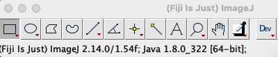
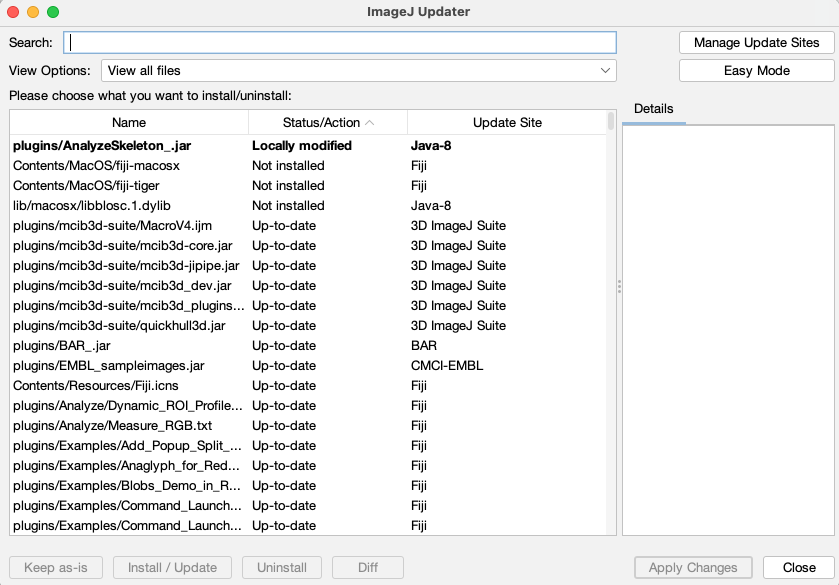
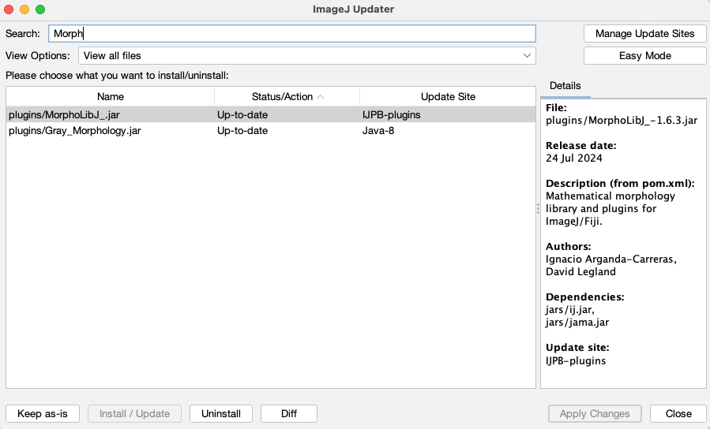

# Fijiのインストールの仕方

20241021 三浦　耕太

## ダウンロードとインストール

以下のリンク先に移動し、使っているマシンに適合したインストーラーをダウンロードしてインストールすればよい。

Fiji  
https://imagej.net/software/fiji/

なお、Fijiを使った解析を論文で公表する場合には、かならず以下の文献を引用する。

Schindelin, J., Arganda-Carreras, I., Frise, E., Kaynig, V., Longair, M., Pietzsch, T., … Cardona, A. (2012). Fiji: an open-source platform for biological-image analysis. Nature Methods, 9(7), 676–682. [doi:10.1038/nmeth.2019](https://doi.org/10.1038/nmeth.2019)

## Windowsのマシンに関する注意

64bitと32bitのインストーラがある。最近のマシンはほぼすべて64bitだと思われるが、OSの設定＞システム＞バージョン情報を選び、そこにマシンが32bitか64bitが書いてあるので、確認するとよいだろう。

また、Fijiはデスクトップに置くとよい。Windowsでのパスの問題や、ファイルを追加したり変更する際の権限の問題でエラーが発生することがあるので、これを回避するためである。


## Macのマシンに関する注意

M1, M2, M3など最近のマックのCPUはarm64と呼ばれるタイプで（シリコンマックとも呼ばれる）、一般的なインテルのCPU(x86, x64などと略称される)とは演算の命令の仕方が異なっている。このため、これらのタイプのCPUを搭載したマシンでは、ダンロードしたFijiはエミュレーションと呼ばれる方法を使ってインテルのCPUを模した計算が行われる。これは、提供されているFijiのMacOS用インストーラーは、インテル用のJavaの実行環境になっているからである。エミュレーションが使われると、計算速度は遅くなる。とはいえ、大きな3次元画像の畳み込み計算やデコンボリューションなどのヘビーな処理でなければ、この差はあまり感じないだろう。

もし、arm64のCPUに直接命令を下して計算を行いたい場合には、一応手段はあるが、コンピュータに使い慣れていないとかなりややこしい。"no JRE"と書かれているJavaの実行環境（Java Runtime Environment, 略してJRE）が同梱されていないFijiのインストーラーをダウンロードし、また、それとは別に自分のマシンにZuluJREなど、arm64用のJavaの実行環境をインストールする。ただし、この場合にはJava3Dなどのライブラリが使えないという問題があり、例えば"3D viewer"は使えなくなる。それでもなおarm64のCPUをそのまま使いたい場合は、最近の状況などは下にリンクしたスレッドで最新の情報を確認するとよいだろう。状況は流動的である。

Fiji, CLIJ, etc. *native* on Apple Silicon (arm64) M1

https://forum.image.sc/t/fiji-clij-etc-native-on-apple-silicon-arm64-m1/53627/25


## バージョン番号

論文にFijiを記載する際に、使ったバージョン番号を記載することは必須である。バージョン番号は以下のようにいくつかの方法で知ることができる。

#### 立ち上げたときに情報バーに表示される。



この例に従えば、例えば論文では次のように記載する。

```
Fiji version 2.14.0/1.54f was used for image analysis (Schindelin et al, 2012)
```

#### スクリプトで知る

Jythonのスクリプトであれば

```
from ij import IJ

print(IJ.getVersion())
#  IJ.getVersion: 2.14.0/1.54f
```

のようにして知ることもできる。

### プラグインのバージョン番号

論文では使ったプラグインのバージョン番号も記載すべきである。バージョン番号によって、計算方法が変わっていることは珍しくない。

バージョン番号は、ImageJ Updater機能で知ることができる。メニューから[Help > Update...]を選ぶと、状態を自動スキャンしたあとで、ImageJ Updaterのウィンドウが表示される。ウィンドウの下の"Advanced Mode"のボタンをクリックしてウィンドウの表示を変え、上から二行目の"View Options"のドロップダウンメニューから"View all files"を選ぶと、下の図のようにFijiのすべてのファイルが表示される。



この状態で、一番上の"Search"の検索フィールドにMorphoLibJの先頭の"Morph"と打ち込んでリストを絞り込む。そうすると、下の図のようにヒットしたファイルがリストされる。plugins/MorphoLibJ_.jarをクリックすると、右側の"Details"というフィールドに、このファイルの詳細が表示される。




この情報のうち、"File:"に続くFile名にある3ケタの数字（ここでは1.6.3）が使っているMorphoLibJのバージョン番号である。したがって論文には

```
For 3D connected component analysis, MorpholibJ version 1.6.3 was used (Legland et. al. 2016).
```

のように表記する。

