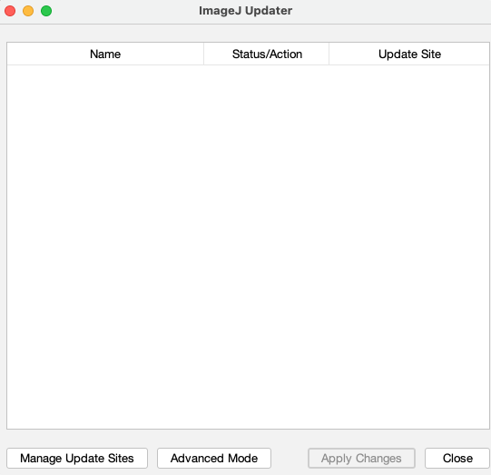
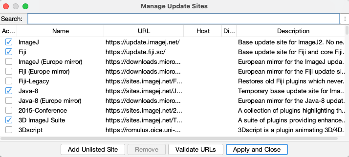
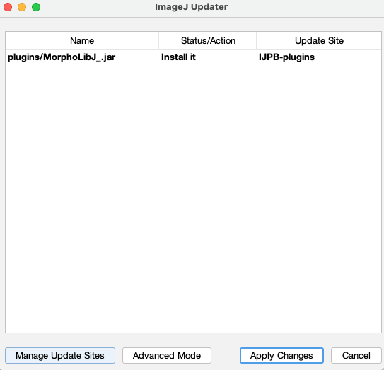

# Update Siteを使ってFijiにプラグインを追加する方法

Fijiへのプラグインの追加は"Update Sites"という機能を使って簡単に行うことができる。以下にプラグインMorpholibJをインストールする場合の手順を解説する。

## プラグインの追加

メニューから[Help > Update]を選ぶと、ImageJ Updaterのウィンドウが表示されるが、このときにもしアップデート必要なものがそこにリストされているならば、できるだけ更新作業をまず行って、Fijiを再起動させてから以下のプラグインの追加を行う（この更新方法は[FIjiを最新状態にする方法](UpdatingFiji.md)参照）。既存のプラグインの更新と新たなプラグインの追加は同時に行えるが、更新後にもしなんらかのエラーがあったときに、なにが原因なのかわかりにくくなるので、2つの操作は別々に行った方が良い。

さて、更新が必要でないならば、図1のようにImageJ Updaterにはなにもリストされていない状態のはずである。

図1 すべてが最新状態の場合のImageJ Updaterのウィンドウ

ここで、下に並んでいるボタンのうち、"Manage Update Sites”というボタンをクリックする。すると、新たなウィンドウが登場する。

図2 Manage Update Siteのウィンドウ。

ここにリストされているのは、それぞれが"Update Site"と呼ばれる、最新のプラグインを保持しているサーバーで、それぞれその名前（Name）、URL、簡単な説明（Description）が書かれている。図2にある"3D ImageJ Suite"は「2-5 血管腫瘍における三次元管状構造ネットワークの分析」で使うプラグインである。その行の左端のチェックボックスに青いチェックが入っている。これはそのプラグインがインストールされていることを示している。

MorphoLibJのUpdate Siteの名前は"IJPB-plugins"である。これは図2のリストを下にスクロールしてゆくと、見つけることができるので、そこにチェックを入れ、"Apply and Close"を押す。すると、図3のように"ImageJ Updater"のウィンドウに新たに1行が加わっているだろう。これが、インストールされるファイルである。

図3　インストールするファイルが新たにリストされたImageJ Updater

図3の"Apply Changes"のボタンをクリックすると、ダウンロードとインストールが行われ、図4のウィンドウが表示される。OKをクリックして、Fijiをリスタートすれば、プラグインのインストールは完了である。

