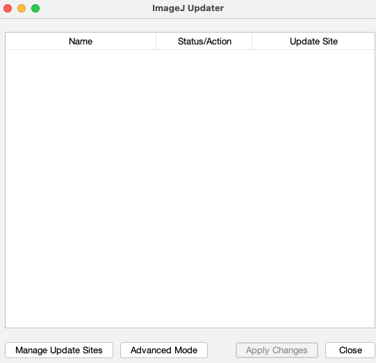
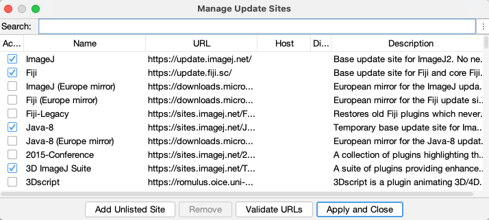

# Update Siteを使ってFijiにプラグインを追加する方法

Fijiへのプラグインの追加は"Update Sites"という機能を使って簡単に行うことができる。以下にプラグインMorpholibJをインストールする場合の手順を解説する。

Fijiのメニューから[Help > Update]を選ぶと、プログレスバーのついた小さなウィンドウが現れ、しばらく現在のFijiのアップデート状況をウェブ上で確認する作業が自動的に始まる。この作業のあとに、図1のような"ImageJ Updater"という名前のウィンドウが表示される。

図1 ImageJ Updaterのウィンドウ

これは、自分のFijiにインストールされているさまざまなライブラリやプラグインのアップデート状況を確認した結果であり、"Name"の列がそのライブラリやプラグインの名前、""Status/Action"が更新状況、"Update Site"が、そのライブラリやプラグインが管理されているサーバーの略称である。更新状況が"Update it"になっている行は、そのライブラリないしプラグインにより新しいバージョンがあるので、更新が可能であることを示している。このまま"Apply Changes"というボタンをクリックすれば、更新が始まる。更新が完了すると、"Updated Successfully. Please restart ImageJ!"とその旨が表示されるので"OK"ボタンをクリックし、Fijiを再起動すれば、Fijiそのものとプラグインが最新になった状態でFijiを使うことができる。

なお、ImageJ Updaterに"Install it"と表示されている行は、新たに追加されるライブラリやプラグインで、これはFiji全体のシステムで新たに必要になったライブラリや、すでにインストールしているプラグインが新たに依存するようになったライブラリであり、これは上の更新作業と同時に新たにインストールされる。

## プラグインの追加

メニューから[Help > Update]を選ぶと、ImageJ Updaterのウィンドウが表示されるが、このときにもしアップデート必要なものがそこにリストされているならば、できるだけ更新作業をまず行って、Fijiを再起動させてから以下のプラグインの追加を行う。既存のプラグインの更新と新たなプラグインの追加は同時に行えるが、更新後にもしなんらかのエラーがあったときに、なにが原因なのかわかりにくくなるので、2つの操作は別々に行った方が良い。

さて、更新が必要でないならば、図2のようにImageJ Updaterにはなにもリストされていない状態のはずである。

図2 すべてが最新状態の場合のImageJ Updaterのウィンドウ

ここで、下に並んでいるボタンのうち、"Manage Update Sites”というボタンをクリックする。すると、新たなウィンドウが登場する。

図3 Manage Update Siteのウィンドウ。

ここにリストされている

