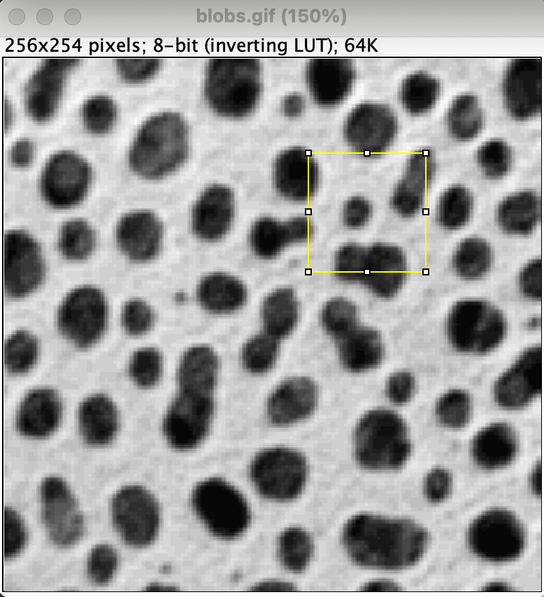
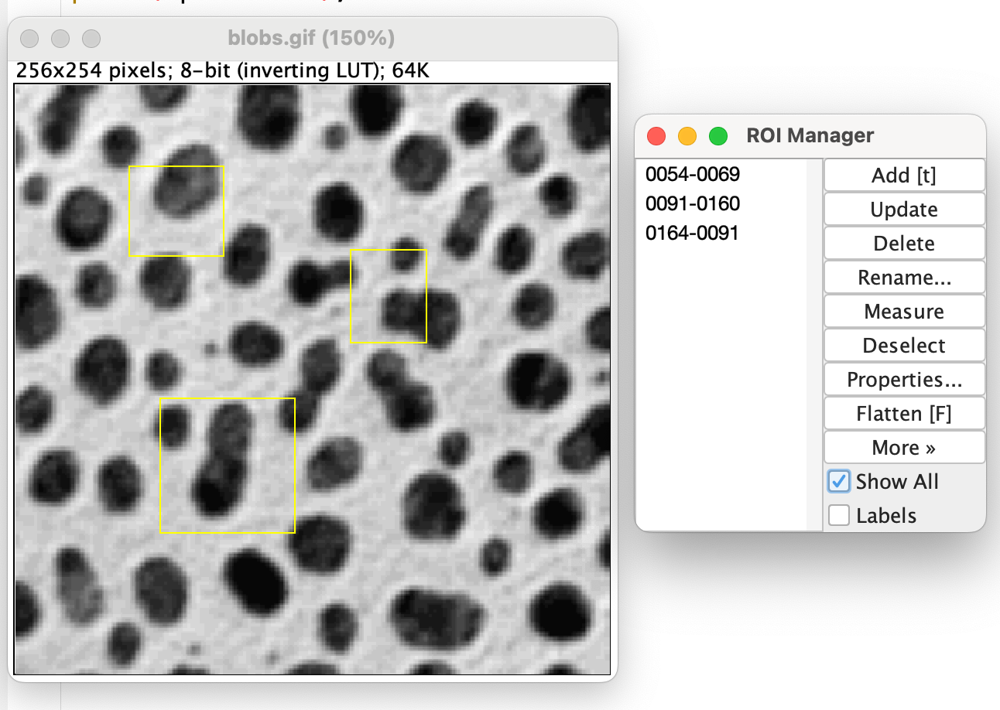

# 選択領域の保存の仕方

三浦　耕太

手動で設置した選択領域（ROI）は、その領域を測定したり、あるいはオリジナルの画像から一部分を切り抜いたり、といった工程で使われる。作業工程全体の中では鍵となるパラメータともいえ、とくに論文で扱った解析の作業工程の再現性を確保するために、手動で設置した選択領域は必ず保存し作業工程とともに公開すべきである。以下では、選択領域の保存の仕方を解説する。

## ひとつの画像に対して選択領域がひとつだけの場合

例としてサンプル画像を開こう（[File > Open Samples > Blobs]）。矩形選択領域ツールで、任意の大きさの選択領域をマウスを使って設置し（図1）、[File > Save As > Selection…]を選ぶと、ファイル保存のウィンドウが開き、選択領域のファイルを保存する場所を選ぶことができる。自動的に"blobs.roi"という名前がついているが、この名前は自由に変えてもよい。ただし、どの画像の選択領域だったのかわからなくなるので、選択領域が一つだけならば自動的についた名前をそのまま使うのがよいだろう。ファイルは自分のマシンの好きな場所に保存しよう。論文を投稿する際にはSupplementary Materialsの一つとして添えるとよい。

さて、選択領域が正しく保存されているかどうか確かめてみよう。まずblobs.gifの画像から上で作成した選択領域をいったん消す（選択領域の外をクリックするか、[Edit > Selection > Select None]）。次に、[File > Open…]で、先ほど保存したblobs.roiを選ぶ。画像にさきほどと同じROIがそこに設置されてることを確認しよう。

図１

## ひとつの画像に対して選択領域が複数の場合

複数のROIを保存する場合はまず[Analyze > Tools > Roi Manager…]を選んでROI Managerのウィンドウを開く。選択領域を設置するたびにROI Managerの"Add"のボタンをクリックする。すると順次、選択領域がROI managerに登録される。図２はこうして３つの選択領域を設置したところである（Show Allにチェックをいれるとすべての選択領域が表示される）。８桁の数字は自動的に名付けられたそれぞれの選択領域の名前で、３つの選択領域が登録されてリストになっている。

これら３つの選択領域をまとめて保存するには、リストの一番上の選択領域をクリックし、次にシフトを押しながら一番下の選択領域をクリックする。こうするとすべての選択領域の名前が反転した状態になる。この状態で、右側一番下にある"More>>"のボタンをクリックすると、ドロップダウンメニューが表示される。この中から"Save…"を選ぶと、ファイルを保存するためのウィンドウが開く。ウィンドウには"Save ROIs…"と題名がついているはずである。ファイル名はデフォルトで"RoiSet.zip"となっているはずである。ここで任意の名前に変更してよいが、拡張子の".zip"は変えないようにしよう。保存先は好きな場所でよい。OKボタンをクリックすれば、さきほどの３つの選択領域がまとめて一つのファイルとして保存される。

確かに保存されたかどうか確認するには、まずROI Managerを閉じる。画像に残っている選択領域も消す。blobs.gifは、開いたときと同じ状態になっているはずである。[File > Open…]で先程保存した.zipファイルを指定して開くと、自動的にROI Managerが表示され、そこには先程保存した３つの選択領域がリストされているはずである。ROI Managerの"More>>"でリストされる中から"Open…"を選んでも、同じように.zipファイル（あるいは.roiファイルでもよい）を読み込んで選択領域のリストを開くことができる。

図２

